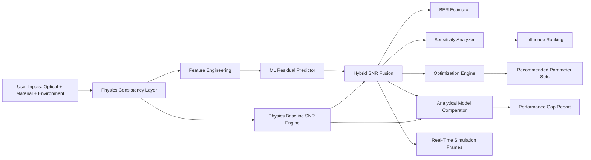

# AI-Driven Optical Storage Performance Optimization Framework

## 1) Strong Research Title Options

1. **OptiStore-AI: A Hybrid Physics-Informed Machine Learning Framework for Joint SNR-BER Prediction and Optimization in Optical Storage Systems**
2. **Hybrid Analytical-AI Optimization of Optical Storage Channels: Real-Time SNR/BER Estimation with Sensitivity-Aware Parameter Control**
3. **Physics-Guided Intelligent Performance Tuning for Optical Media: A National-Scale Framework for Predictive SNR and BER Minimization**

---

## 2) Problem Statement

Modern optical storage systems require a careful balance of optical, material, and environmental parameters to maintain high reliability. Conventional analytical models provide deterministic SNR estimates but underperform when non-linear interactions (material aging, humidity effects, multilayer interference, and electronic compensation interactions) become significant. This project addresses the challenge by introducing a hybrid physics + machine learning framework that:

- Predicts SNR more accurately than analytical baselines,
- Converts predicted SNR into BER for direct reliability interpretation,
- Optimizes system settings for maximum signal quality and minimum bit errors,
- Explains parameter impact through sensitivity ranking,
- Supports real-time simulation for adaptive design decisions.

---

## 3) Core Mathematical Formulation

### 3.1 Physics Baseline SNR

The deterministic optical-storage baseline model:

$$
\text{SNR}_{\text{physics}} = 85 + 30\,NA - 0.02\,\lambda - 15\,\text{ISI} - 10\,\text{XT} + 5\,\Theta
$$

Where:
- $NA$ = numerical aperture,
- $\lambda$ = laser wavelength (nm),
- ISI = inter-symbol interference factor,
- XT = crosstalk factor,
- $\Theta$ = thermal reliability factor.

Thermal factor:

$$
\Theta = \exp\left(-\frac{E_a}{k_B T}\right)
$$

with activation energy $E_a$, Boltzmann constant $k_B$, and absolute temperature $T$.

### 3.2 Hybrid Physics + ML Residual Learning

The model predicts a residual term:

$$
\Delta_{\text{ML}} = f_{\text{GBR}}(\mathbf{x})
$$

Final prediction:

$$
\text{SNR}_{\text{hybrid}} = \text{SNR}_{\text{physics}} + \Delta_{\text{ML}}
$$

This preserves physical interpretability while learning complex non-linear corrections.

### 3.3 BER Estimation from Predicted SNR

Convert dB to linear scale:

$$
\gamma = 10^{\frac{\text{SNR}_{\text{hybrid}}}{10}}
$$

For BPSK/QPSK over AWGN:

$$
\text{BER} = \frac{1}{2}\,\text{erfc}(\sqrt{\gamma})
$$

For OOK-NRZ approximation:

$$
\text{BER} = \frac{1}{2}\,\text{erfc}\left(\sqrt{\frac{\gamma}{2}}\right)
$$

### 3.4 Multi-objective Optimization Criterion

A scalarized objective used for candidate ranking:

$$
J = \text{SNR}_{\text{hybrid}} - 10\log_{10}(\text{BER} + \epsilon)
$$

where $\epsilon$ avoids numerical singularity. Maximizing $J$ favors high SNR and low BER simultaneously.

### 3.5 Sensitivity Analysis (Local Normalized)

For parameter $p_i$:

$$
S_i = \left|\frac{\partial \text{SNR}}{\partial p_i} \cdot \frac{p_i}{\text{SNR}}\right|
$$

Estimated numerically via central difference to rank influential parameters.

---

## 4) Implemented Framework Components

### A. Joint SNR + BER Inference
- Endpoint computes hybrid predicted SNR and BER in one flow.
- Supports modulation-aware BER estimation (`OOK-NRZ`, `BPSK`, `QPSK`).

### B. Parameter Optimization Engine
- Performs constrained candidate search around operating point.
- Returns top-$k$ recommendations with predicted SNR, BER, and objective score.

### C. Sensitivity Analysis Module
- Produces normalized sensitivity ranking across optical, environmental, and material-linked variables.
- Helps designers prioritize calibration efforts.

### D. Analytical vs ML Comparison
- Reports physics-only vs hybrid predictions.
- Includes BER comparison and (optional) measured-SNR error comparison.

### E. Real-Time Dashboard Simulation API
- Generates sequential frames over a swept parameter.
- Ready for live charting in frontend/dashboard tools.

---

## 5) System Architecture (Diagram Explanation)

### Mermaid Architecture

### Interpretation
1. **Physics Consistency Layer** recomputes dependent terms (spot size, ISI, crosstalk) for physically valid inputs.
2. **Dual-path inference** computes analytical baseline and ML residual in parallel.
3. **Fusion stage** produces robust hybrid SNR estimate.
4. **Decision-intelligence modules** convert SNR into BER, rank influential parameters, and propose optimized settings.
5. **Comparison and simulation outputs** support both academic validation and practical deployment.

---

## 6) Traditional Analytical vs AI-Hybrid Positioning

### Analytical Model
- Strength: interpretability, low computational cost.
- Limitation: weak under non-linear couplings and environmental drifts.

### AI-Hybrid Model
- Strength: captures non-linear residual behavior while preserving physical baseline meaning.
- Added value: direct BER estimation, optimization recommendations, and sensitivity-guided explainability.

This “physics-informed residual learning” approach is stronger than purely black-box ML and stronger than fixed analytical models for realistic channels.

---

## 7) Real-Time Simulation Dashboard Concept

A research-demo dashboard should contain:

1. **Live Input Panel**
   - wavelength, NA, track pitch, material, temperature, humidity, coding options (PRML/CTC).

2. **Instant Metrics Panel**
   - Analytical SNR, Hybrid SNR, BER, SNR gain, BER reduction ratio.

3. **Optimization Panel**
   - Top-$k$ suggested parameter sets with expected BER and SNR improvements.

4. **Sensitivity Heatmap**
   - Bar chart of normalized sensitivities for decision support.

5. **Simulation Timeline Plot**
   - Streaming frames for parameter sweeps to emulate real-time behavior.

---

## 8) Novelty Points (Paper/Presentation)

1. **Hybrid physics-informed residual learning** instead of standalone ML.
2. **Unified reliability pipeline**: SNR prediction directly mapped to BER.
3. **Built-in optimization intelligence** for automatic operating-point recommendation.
4. **Explainable sensitivity layer** for interpretable optical-channel tuning.
5. **Comparative validation framework** between analytical and ML-hybrid channels.
6. **Real-time simulation readiness** for adaptive optical-storage management.

---

## 9) Suggested National-Level Abstract (Short)

This work presents an AI-driven Optical Storage Performance Optimization Framework that integrates analytical optics and machine learning residual modeling for accurate Signal-to-Noise Ratio (SNR) prediction under complex operating conditions. The framework derives Bit Error Rate (BER) from predicted SNR, compares hybrid predictions against traditional analytical models, identifies dominant control parameters through normalized sensitivity analysis, and recommends high-performance operating points via multi-objective optimization. A real-time simulation interface concept is included for dynamic parameter sweeps and deployment-oriented visualization. Results position the proposed method as an interpretable and high-impact approach for next-generation optical storage reliability engineering.

---

## 10) Future Scope

1. **Closed-loop hardware-in-the-loop control** with live drive telemetry.
2. **Digital twin extension** for multilayer and aging-aware life-cycle prediction.
3. **Uncertainty quantification** via Bayesian or conformal prediction for confidence-bounded BER.
4. **Reinforcement learning controller** for adaptive parameter policies under dynamic environments.
5. **Generalization to holographic and ultra-dense optical storage media**.
6. **Energy-aware optimization** for green optical-storage systems.

---

## 11) API Endpoints Added in This Framework

- `POST /predict_snr` (existing, preserved)
- `POST /predict_ber`
- `POST /compare_models`
- `POST /optimize_parameters`
- `POST /sensitivity_analysis`
- `POST /simulate_dashboard`

These endpoints collectively implement the full optimization framework required for a research-grade demo.
